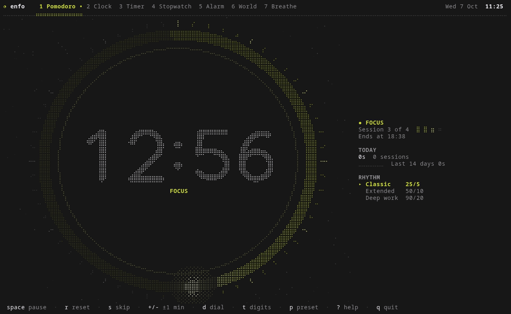
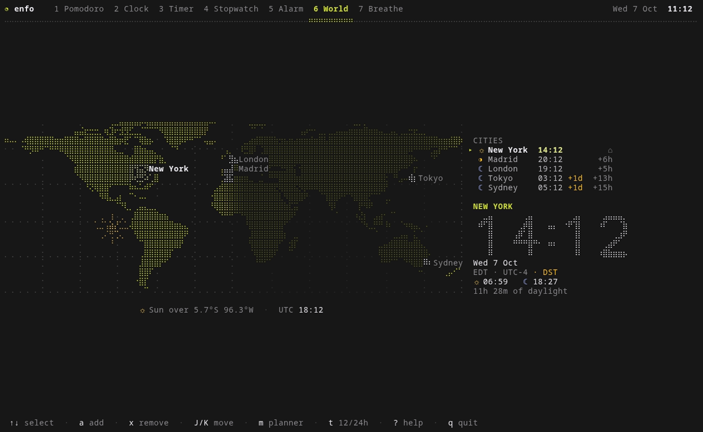
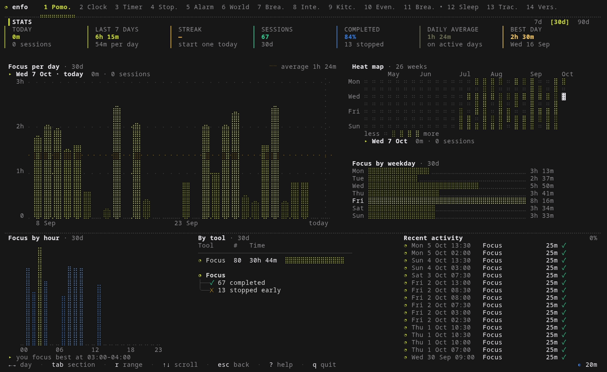
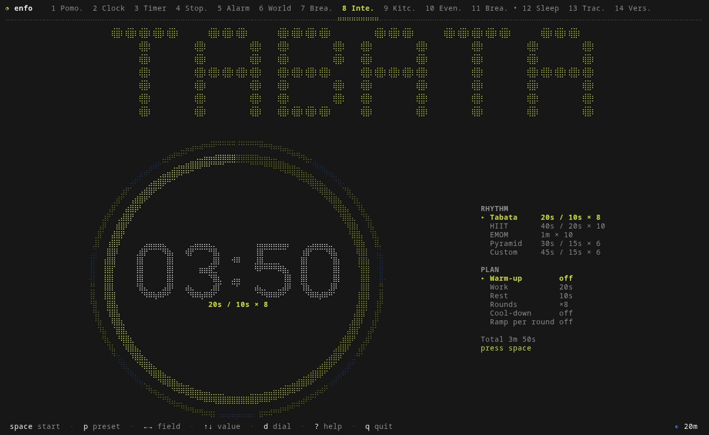

# enfo — focus, in the terminal

Pomodoro, clock, timer, stopwatch, alarms, a world clock with a live day/night map and a breathing
guide. Everything is drawn with **braille dots** (a 2×4 dot grid per terminal cell), animated, responsive
from a 24×7 corner of tmux to a full-screen 4K terminal, and built entirely on the
[Charm](https://charm.land) ecosystem. It is the terminal sibling of the Enfo mobile/desktop app:
same ideology (calm, flat, minimal), same toolbox.


| | |
| --- | --- |
|  |  |
|  |  |

## Install

```sh
# Arch / CachyOS / Omarchy
cd tui && makepkg -si

# anywhere with Go 1.25+
cd tui && make install PREFIX=$HOME/.local       # binary + bash/zsh/fish completions + man page
# or
go install github.com/sazardev/enfo/tui/cmd/enfo@latest
```

Optional, for alerts when a timer ends: `libnotify` (`notify-send`) and a sound player
(`pipewire` → `pw-play`, or `libpulse` → `paplay`) with `sound-theme-freedesktop`.
Run `enfo doctor` to see what your terminal and desktop support (and the command that fixes each gap).

Best in a terminal with truecolor and a font with braille glyphs (kitty, ghostty, wezterm, foot, alacritty,
Windows Terminal …). Dots are square when a cell is about twice as tall as it is wide, which is the usual case.

## Use

```sh
enfo                    # open on your start mode (first run: a short welcome wizard)
enfo timer 10m --start  # open the timer and start it
enfo pomodoro --work 50 --rest 10 --start
enfo alarm add 07:30 --days weekdays -q    # add an alarm without opening the UI
enfo status             # what is running right now (for prompts and bars)
enfo stats              # your focus dashboard, printed
enfo doctor             # check terminal + desktop integration
enfo serve              # run Enfo over SSH
```

### Modes

Numbers `1`–`9` (or `tab` / `shift+tab`, `[` / `]`, or a mouse click) switch mode; the tabs slide.

| Mode | What it is |
| --- | --- |
| **Pomodoro** | Focus / rest with seven animated faces — ring, orbit, hourglass, liquid, radar, spiral, bars — three digit fonts, rhythm presets, long rests, today's stats on the side |
| **Clock** | Analog (sweeping second hand), digital, orbit, binary and a sun/moon day-arc with real sunrise and sunset |
| **Timer** | HH:MM:SS wheels, presets, the same faces as Pomodoro, last-10-seconds urgency |
| **Stopwatch** | Centiseconds, a minute-sweep ring, lap table with best/worst |
| **Alarm** | Repeating or one-shot alarms, snooze, an inline editor, a full-screen ringer |
| **World** | A braille world map shaded live by the sun, cities with their local time, a meeting planner |
| **Breathe** | Box, 4-7-8, coherent and calm patterns over four mesmerizing animations |
| Intervals · Kitchen · Event · Breaks · Sleep · Tracker · Versus | Extras, off by default (`,` → Modes): HIIT/Tabata, several named timers, countdowns to dated events, 20-20-20 style reminders, a sleep-cycle planner, a time tracker, a two-player chess clock |

Global keys: `?` help (a Glamour-rendered manual), `f` zen (only the face), `g` statistics, `,` settings,
`q` / `ctrl+c` quit. Timers keep their exact time while you are in another mode — and after you quit:
a tiny detached waker (`enfo wake`) still raises the desktop notification when your phase, timer or
alarm is due, and reopening Enfo picks everything up where it was.

### For status bars

```sh
enfo status                 # ● focus 24:13
enfo status --json          # machine-readable
enfo status --waybar        # Waybar custom module (Omarchy / Hyprland)
enfo status --tmux          # tmux status-right
```

```jsonc
// ~/.config/waybar/config.jsonc
"custom/enfo": { "exec": "enfo status --waybar", "return-type": "json", "interval": 1, "on-click": "xdg-terminal-exec enfo" }
```
```tmux
set -g status-right '#(enfo status --tmux)'
set -g status-interval 1
```

## Charm, all the way down

| Library | Used for |
| --- | --- |
| [Bubble Tea v2](https://github.com/charmbracelet/bubbletea) | the program: declarative `View`, native progress bar, window title, mouse, focus reporting |
| [Lip Gloss v2](https://github.com/charmbracelet/lipgloss) | layout, tables, trees, and the layer compositor for toasts and overlays |
| [Bubbles](https://github.com/charmbracelet/bubbles) | help footer, text input, viewport, paginator, progress, list, table |
| [Huh](https://github.com/charmbracelet/huh) | the settings forms |
| [Glamour](https://github.com/charmbracelet/glamour) | the in-app manual |
| [Harmonica](https://github.com/charmbracelet/harmonica) | springs: the tab underline, slide transitions, toasts, switches |
| [Fang](https://github.com/charmbracelet/fang) | the CLI: styled help and errors, man page, completions |
| [Wish](https://github.com/charmbracelet/wish) | `enfo serve`, the app over SSH |
| [Log](https://github.com/charmbracelet/log) | `ENFO_DEBUG=1` writes `enfo.log` |
| [VHS](https://github.com/charmbracelet/vhs) | `make demo` renders the GIF above |

## How it is built

```
cmd/enfo            entry point (cobra + fang)
internal/braille    Canvas: 2x4 dots per cell, a color per cell, shapes, three big-digit fonts
internal/visual     timer faces, clock designs, the logo mark, breathing animations
internal/engine     pure, timestamp-driven logic: pomodoro, timer, stopwatch, alarms, sun, cities, stats …
internal/store      config.json, state.json, history.jsonl (XDG dirs)
internal/ui         the app: Core (shared state), App (tabs, toasts, ringer, help), one file group per mode
internal/worldmap   a 720x360 land mask (Natural Earth 110m) sampled at any resolution
internal/i18n       English and Spanish; a test keeps both complete
internal/cli  wake  serve   subcommands, the background waker, the SSH server
```

Design rules worth knowing:

- **Nothing ticks.** Every engine stores absolute instants (when a phase ends, when a run started) and is asked
  what is true *now*, so it is exact while hidden, survives restarts and can be read by `enfo status`.
- **A braille cell has one color**, so shapes get their color per cell; gradients, glows and fades are cell-level.
- **Modes register themselves** (`registerMode` in an `init()`); a mode that must keep running while hidden also
  implements `Background`.
- **Flat and calm**: no borders around the work area, no modals (confirmations are inline), reduced motion
  (`Settings → Look & motion → still`) stops every ambient animation.
- Avoid emoji-presentation glyphs (⏰ ⏱ …): terminals measure them one way and draw them another. Icons live in `ui/mode.go`.

Files: `~/.config/enfo/config.json`, `~/.local/state/enfo/{state.json,history.jsonl}`
(override with `ENFO_CONFIG_DIR` / `ENFO_STATE_DIR`; `ENFO_QUIET=1` silences notifications and sound).

```sh
make test      # go test ./...
make vet       # go vet + gofmt
make demo      # re-render demo/enfo.gif (needs vhs, ttyd, ffmpeg)
make dist      # cross-compiled binaries
```

## En español

Enfo en la terminal: Pomodoro, reloj, temporizador, cronómetro, alarmas, hora mundial con mapa
día/noche y respiración guiada, todo dibujado con puntos braille y animado. La interfaz está en español o
inglés (sigue tu `LANG`, o cámbialo en `,` → Idioma). Instala con `makepkg -si` en Arch/CachyOS/Omarchy o
`make install PREFIX=$HOME/.local`. `enfo status --waybar` integra el temporizador en la barra de Hyprland.
